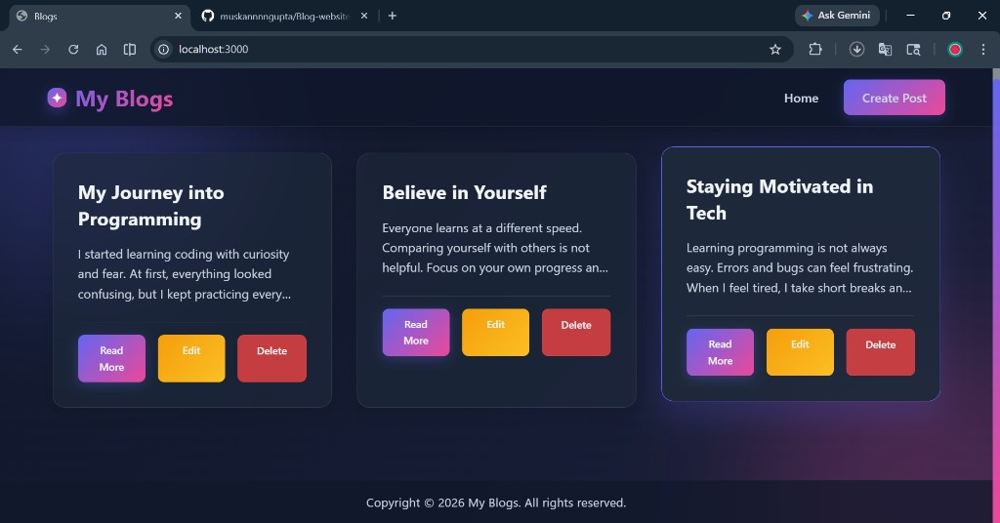
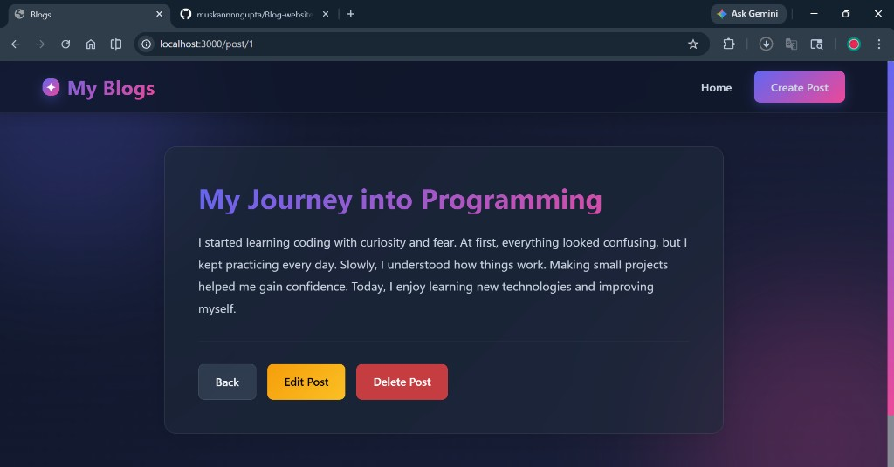
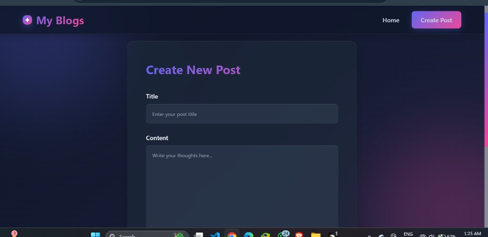

# Blog Website

A modern blog web app built with Node.js, Express, EJS, and custom CSS.

## Features

- Create, read, update, and delete posts (CRUD)
- Stylish responsive UI with gradient + glassmorphism effects
- Pages for home, single post, create post, and edit post

## Tech Stack

- Node.js
- Express.js
- EJS
- HTML/CSS

## Project Structure

- `index.js` - server and routes
- `views/` - EJS pages
- `views/Partials/` - common header/footer
- `public/styles/style.css` - custom styles
- `assets/screenshots/` - README screenshots

## Getting Started

1. Install dependencies:

```bash
npm install
```

2. Run the app:

```bash
node index.js
```

3. Open in browser:

[http://localhost:3000](http://localhost:3000)

## Screenshots

### Home Page



### Single Post Page



### Create Post Page


